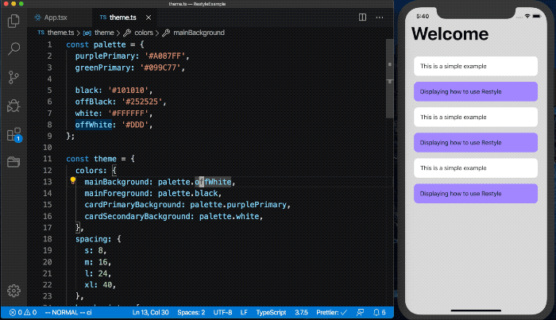
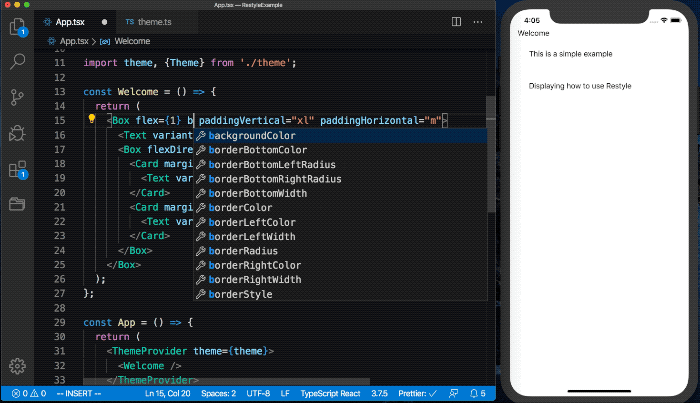

import Tabs from '@theme/Tabs';
import TabItem from '@theme/TabItem';

**Build a consistent, themed UI in minutes.**



The Restyle library provides a type-enforced system for building UI components in React Native with TypeScript. It's a library for building UI libraries, with themability as the core focus.

This library assumes that the UI is built upon a design system that (at the very least) defines a set of colors and spacing constants that lays as a foundation. While the library acknowledges that there can be exceptions to the system by allowing any style to be overridden, it keeps the developer most productive when one-off values are kept to a minimum.

Here's an example of how a view built with Restyle components could look:

```jsx
import {
  ThemeProvider,
  createBox,
  createText,
  createRestyleComponent,
  createVariant,
  VariantProps,
} from '@shopify/restyle';

// See the "Defining your theme" section under "Fundamentals"
import theme, {Theme} from './theme';

const Box = createBox<Theme>();
const Text = createText<Theme>();

const Card = createRestyleComponent<
  VariantProps<Theme, 'cardVariants'> & React.ComponentProps<typeof Box>,
  Theme
>([createVariant({themeKey: 'cardVariants'})], Box);

const Welcome = () => {
  return (
    <Box
      flex={1}
      backgroundColor="mainBackground"
      paddingVertical="xl"
      paddingHorizontal="m"
    >
      <Text variant="header">Welcome</Text>
      <Box
        flexDirection={{
          phone: 'column',
          tablet: 'row',
        }}
      >
        <Card margin="s" variant="secondary">
          <Text variant="body">This is a simple example</Text>
        </Card>
        <Card margin="s" variant="primary">
          <Text variant="body">Displaying how to use Restyle</Text>
        </Card>
      </Box>
    </Box>
  );
};

const App = () => {
  return (
    <ThemeProvider theme={theme}>
      <Welcome />
    </ThemeProvider>
  );
};
```



## Installation

Add the package to your project:

<Tabs>
  <TabItem value="yarn" label="Yarn" default>

```bash
yarn add @shopify/flash-list
```

  </TabItem>
  <TabItem value="npm" label="Npm">

```bash
npm install @shopify/flash-list
```

  </TabItem>
  <TabItem value="expo" label="Expo">

```bash
npx expo install @shopify/flash-list
```

  </TabItem>
</Tabs>

## Usage

Read more about the usage of `Restyle` [here](/fundamentals).

## Playground

<!-- TODO: Add link to fixture app once this PR https://github.com/Shopify/restyle/pull/212 is merged -->

The [fixture](/) is an example app showing how to use the library.
